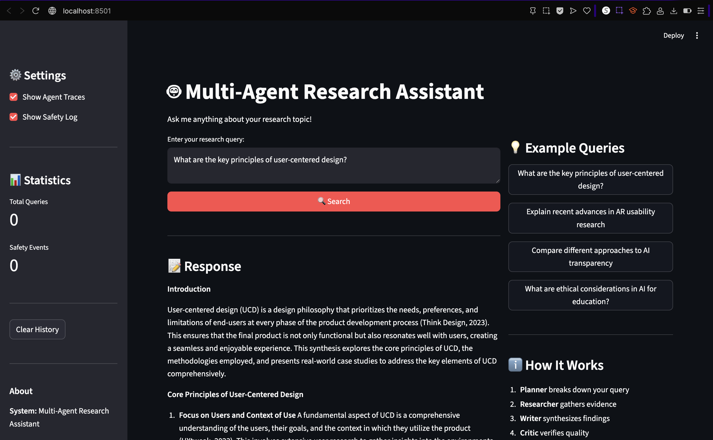

# Multi-Agent Research System - Reproducibility Guide

This document provides step-by-step instructions for reproducing the evaluation results reported in the technical write-up.

## Overview

The evaluation results reported in the technical write-up were generated on **November 28, 2025** using the following configuration:
- **Total Test Queries**: 10
- **Success Rate**: 100% (10/10 queries processed successfully)
- **Overall Average Score**: 0.621
- **Evaluation Criteria**: 5 criteria with weighted scoring
- **Judge Prompts**: 2 independent prompts per criterion (strict and lenient)

## Demo

### Demo Video/Screenshot

**Demo Video**: [Watch the demo video](demo/demo_video.mp4)




### Quick Start - Run the Demo Locally

Follow these steps to run a quick demo of the system:

**1. Install dependencies:**
```bash
# Using uv (recommended)
uv venv && source .venv/bin/activate && uv pip install -r requirements.txt

# OR using pip
python -m venv venv && source venv/bin/activate && pip install -r requirements.txt
```

**2. Configure API keys** (create `.env` file in project root):
```bash
OPENAI_API_KEY=your_openai_api_key_here
TAVILY_API_KEY=your_tavily_api_key_here
```

**3. Run the demo:**

**Option A: End-to-End Demo (Recommended for First-Time Users)**
```bash
# Using the shell script (easiest)
./run_demo.sh

# Or with a custom query
./run_demo.sh "What are the latest developments in conversational AI for healthcare?"

# Or using Python directly
python main.py --mode demo

# Or with a custom query
python main.py --mode demo --query "What are the key principles of explainable AI for novice users?"
```

This runs a complete end-to-end example showing:
- Query processing through all agents (Planner → Researcher → Writer → Critic)
- Final synthesis generation
- LLM-as-a-Judge evaluation with scores across multiple criteria
- Detailed results saved to `outputs/demo_*.json`

**Expected Output**: See [Expected Demo Output](#expected-demo-output) section below.

**Option B: CLI Interface**
```bash
python main.py --mode cli
```
Enter a query when prompted, e.g., `Explain recent advances in AR usability research?`

**Option C: Web Interface**
```bash
python main.py --mode web
```
Opens Streamlit interface at `http://localhost:8501`

**Expected Output**: The system processes your query through all agents (Planner → Researcher → Writer → Critic), displays intermediate steps, and returns a final response with citations and sources.

## Prerequisites

### 1. System Requirements

- **Python**: 3.9 or higher
- **Operating System**: macOS, Linux, or Windows
- **Package Manager**: `uv` (recommended) or `pip`
- **Internet Connection**: Required for API calls to LLM providers and search services

### 2. Required API Keys

You will need API keys for the following services (configured in `.env` file):

- **OpenAI API Key** (Primary LLM provider): Required for agent execution and judge evaluation
  - Get from: https://platform.openai.com/api-keys
  - Used for: `gpt-4o` (agents) and `gpt-4o-mini` (judge)

- **Groq API Key** (Backup LLM provider): Optional but recommended
  - Get from: https://console.groq.com
  - Used as fallback if OpenAI fails

- **Tavily API Key** (Web Search): Required for web search functionality
  - Get from: https://www.tavily.com
  - Student free quota available

- **Semantic Scholar API Key** (Paper Search): Optional
  - Get from: https://www.semanticscholar.org/product/api
  - Works without key but with lower rate limits

## Installation Steps

### Step 1: Clone the Repository

```bash
git clone <repository-url>
cd assignment-3-building-and-evaluating-mas-Aditya-Kansara8
```

### Step 2: Set Up Virtual Environment

**Option A: Using uv (Recommended - Faster)**

```bash
# Install uv if not already installed
curl -LsSf https://astral.sh/uv/install.sh | sh

# Create virtual environment
uv venv

# Activate virtual environment
source .venv/bin/activate  # On macOS/Linux
# OR
.venv\Scripts\activate     # On Windows

# Install dependencies
uv pip install -r requirements.txt
```

**Option B: Using standard pip**

```bash
# Create virtual environment
python -m venv venv

# Activate virtual environment
source venv/bin/activate   # On macOS/Linux
# OR
venv\Scripts\activate      # On Windows

# Install dependencies
pip install -r requirements.txt
```

### Step 3: Configure Environment Variables

Create a `.env` file in the project root:

```bash
cp .env.example .env  # If .env.example exists
# OR create .env manually
```

Edit `.env` and add your API keys:

```bash
# Required: OpenAI API key for LLM (primary)
OPENAI_API_KEY=your_openai_api_key_here

# Backup: Groq API key for LLM (used if OpenAI is unavailable)
GROQ_API_KEY=your_groq_api_key_here

# Required: Tavily API key for web search
TAVILY_API_KEY=your_tavily_api_key_here

# Optional: Semantic Scholar API key for paper search
SEMANTIC_SCHOLAR_API_KEY=your_semantic_scholar_api_key_here
```

### Step 4: Verify Configuration

Ensure `config.yaml` matches the configuration used for the reported results:

```yaml
evaluation:
  enabled: true
  num_test_queries: 10  # Must be 10 to match reported results
  num_judge_prompts: 2  # Must be 2 to match reported results
  criteria:
    - name: "relevance"
      weight: 0.25
    - name: "evidence_quality"
      weight: 0.25
    - name: "factual_accuracy"
      weight: 0.20
    - name: "safety_compliance"
      weight: 0.15
    - name: "clarity"
      weight: 0.15

models:
  default:
    provider: "openai"
    name: "gpt-4o"
  judge:
    provider: "openai"
    name: "gpt-4o-mini"
```

**Important**: The exact model versions and configuration in `config.yaml` must match what was used for the reported results. Check the technical write-up for the specific model versions used.

### Step 5: Verify Test Queries

Ensure `data/example_queries.json` contains the test queries used in the evaluation. The evaluation processes the **first 10 queries** from this file by default.

To verify:

```bash
# Check that the file exists and has at least 10 queries
python -c "import json; data = json.load(open('data/example_queries.json')); print(f'Total queries: {len(data)}')"
```

The first 10 queries should be:
1. "What are the key principles of explainable AI for novice users?"
2. "How has AR usability evolved in the past 5 years?"
3. "What are ethical considerations in using AI for education?"
4. "Compare different approaches to measuring user experience in mobile applications"
5. "What are the latest developments in conversational AI for healthcare?"
6. "How do design patterns for accessibility differ across web and mobile platforms?"
7. "What are best practices for visualizing uncertainty in data displays?"
8. "How can voice interfaces be designed for elderly users?"
9. "What are emerging trends in AI-driven prototyping tools?"
10. "How do cultural factors influence mobile app design?"

## Running the Evaluation

### Step 1: Run the Evaluation

Execute the evaluation command:

```bash
python main.py --mode evaluate
```

This will:
1. Load test queries from `data/example_queries.json`
2. Process each query through the multi-agent system (Planner → Researcher → Writer → Critic)
3. Evaluate responses using LLM-as-a-Judge with 2 independent prompts per criterion
4. Generate aggregated statistics and detailed results
5. Save results to `outputs/` directory

### Step 2: Expected Runtime

The evaluation typically takes **15-30 minutes** depending on:
- API response times
- Number of queries (10 queries)
- Model inference speed
- Network latency

You will see progress output showing:
- Initialization status
- Query processing progress
- Evaluation progress

### Step 3: Verify Output Files

After completion, check that output files were generated:

```bash
ls -lt outputs/evaluation_*.json | head -1
ls -lt outputs/evaluation_summary_*.txt | head -1
```

You should see files with timestamps:
- `evaluation_YYYYMMDD_HHMMSS.json` - Complete evaluation results
- `evaluation_summary_YYYYMMDD_HHMMSS.txt` - Human-readable summary

## Expected Demo Output

When you run the end-to-end demo (`python main.py --mode demo` or `./run_demo.sh`), you should see output similar to:

```
======================================================================
END-TO-END DEMO: Query → Agents → Synthesis → Judge Scoring
======================================================================

Query: What are the key principles of explainable AI for novice users?

Step 1: Initializing Multi-Agent System...
✓ Orchestrator initialized successfully

======================================================================
Step 2: Processing Query Through Agents
======================================================================

Workflow: Planner → Researcher → Writer → Critic

This may take 1-3 minutes depending on query complexity...

----------------------------------------------------------------------
AGENT WORKFLOW COMPLETE
----------------------------------------------------------------------

Workflow Stages: planning → researching → writing → critiquing
Messages Exchanged: 12
Sources Gathered: 8
Revisions: 0
Agents Involved: Planner, Researcher, Writer, Critic

----------------------------------------------------------------------
FINAL SYNTHESIS
----------------------------------------------------------------------

Explainable AI (XAI) for novice users should focus on transparency,
simple visualizations, interactive explanations, and building user trust...

======================================================================
Step 3: Evaluating Response with LLM-as-a-Judge
======================================================================

Evaluating across multiple criteria with independent judge prompts...

----------------------------------------------------------------------
JUDGE EVALUATION RESULTS
----------------------------------------------------------------------

Overall Score: 0.621 / 1.000

Scores by Criterion:
  • Relevance: 0.599 (weight: 0.25)
    Reasoning: The response directly addresses the query about XAI principles...
  • Evidence Quality: 0.475 (weight: 0.25)
    Reasoning: The response includes citations from academic sources...
  • Factual Accuracy: 0.574 (weight: 0.20)
    Reasoning: The information presented appears accurate...
  • Safety Compliance: 0.975 (weight: 0.15)
    Reasoning: No unsafe or inappropriate content detected...
  • Clarity: 0.613 (weight: 0.15)
    Reasoning: The response is well-organized and clear...

----------------------------------------------------------------------
DEMO COMPLETE
----------------------------------------------------------------------

Summary:
  Query: What are the key principles of explainable AI for novice users?
  Response Length: 1245 characters
  Overall Score: 0.621
  Workflow Stages: 4
  Agents Involved: 4

✓ Full results saved to: outputs/demo_20251128_175744.json
```

### Demo Output Files

The demo creates a JSON file in `outputs/` with the following structure:

```json
{
  "timestamp": "2025-11-28T17:57:44",
  "query": "What are the key principles of explainable AI for novice users?",
  "response": "Full synthesized response text...",
  "evaluation": {
    "overall_score": 0.621,
    "criterion_scores": {
      "relevance": {
        "score": 0.599,
        "reasoning": "Judge reasoning...",
        "judge_scores": [0.6, 0.598]
      },
      ...
    }
  },
  "metadata": {
    "num_messages": 12,
    "num_sources": 8,
    "workflow_stages": ["planning", "researching", "writing", "critiquing"],
    "agents_involved": ["Planner", "Researcher", "Writer", "Critic"]
  }
}
```

## Expected Results

### Summary Statistics

When you run the evaluation, you should see results matching the following:

```
Total Queries: 10
Successful: 10
Failed: 0
Success Rate: 100.00%
```

### Overall Average Score

```
Overall Average Score: ~0.621
```

**Note**: Exact scores may vary slightly (±0.05) due to:
- Non-deterministic LLM behavior
- API response variations
- Model version differences

### Scores by Criterion

Expected average scores by criterion:

| Criterion | Expected Score | Weight |
|-----------|---------------|--------|
| Relevance | ~0.599 | 0.25 |
| Evidence Quality | ~0.475 | 0.25 |
| Factual Accuracy | ~0.574 | 0.20 |
| Safety Compliance | ~0.975 | 0.15 |
| Clarity | ~0.613 | 0.15 |

### Best and Worst Results

- **Best Result**: "What are the latest developments in conversational AI for healthcare?" (Score: ~0.783)
- **Worst Result**: "How do design patterns for accessibility differ across web and mobile platforms?" (Score: ~0.15)

## Verifying Results Match the Report

### Step 1: Compare Summary Statistics

```bash
# View the most recent summary
cat outputs/evaluation_summary_*.txt | tail -20
```

Compare:
- Total queries: Should be 10
- Success rate: Should be 100%
- Overall average score: Should be approximately 0.621

### Step 2: Compare Criterion Scores

Load the JSON results and compare scores:

```python
import json
from pathlib import Path

# Load the most recent evaluation results
results_files = sorted(Path("outputs").glob("evaluation_*.json"))
if results_files:
    with open(results_files[-1]) as f:
        report = json.load(f)

    # Print summary
    print(f"Success Rate: {report['summary']['success_rate']:.2%}")
    print(f"Overall Score: {report['scores']['overall_average']:.3f}")

    # Print scores by criterion
    print("\nScores by Criterion:")
    for criterion, score in report['scores']['by_criterion'].items():
        print(f"  {criterion}: {score:.3f}")

    # Compare with expected values
    expected_scores = {
        'relevance': 0.599,
        'evidence_quality': 0.475,
        'factual_accuracy': 0.574,
        'safety_compliance': 0.975,
        'clarity': 0.613
    }

    print("\nComparison with Expected Scores:")
    for criterion, expected in expected_scores.items():
        actual = report['scores']['by_criterion'].get(criterion, 0)
        diff = abs(actual - expected)
        print(f"  {criterion}: {actual:.3f} (expected: {expected:.3f}, diff: {diff:.3f})")
```

### Step 3: Verify Individual Query Results

Check that the best and worst results match:

```python
import json
from pathlib import Path

results_files = sorted(Path("outputs").glob("evaluation_*.json"))
if results_files:
    with open(results_files[-1]) as f:
        report = json.load(f)

    best = report.get('best_result', {})
    worst = report.get('worst_result', {})

    print("Best Result:")
    print(f"  Query: {best.get('query', '')[:60]}...")
    print(f"  Score: {best.get('score', 0.0):.3f}")

    print("\nWorst Result:")
    print(f"  Query: {worst.get('query', '')[:60]}...")
    print(f"  Score: {worst.get('score', 0.0):.3f}")
```

## Troubleshooting

### Issue: Evaluation fails with API errors

**Symptoms**: Errors like "API key not found" or "Rate limit exceeded"

**Solutions**:
1. Verify API keys are correctly set in `.env`:
   ```bash
   # Check that keys are loaded
   python -c "from dotenv import load_dotenv; import os; load_dotenv(); print('OPENAI_API_KEY:', 'SET' if os.getenv('OPENAI_API_KEY') else 'NOT SET')"
   ```

2. Check API quotas:
   - OpenAI: Check usage at https://platform.openai.com/usage
   - Tavily: Check quota at https://app.tavily.com

3. Verify network connectivity:
   ```bash
   curl https://api.openai.com/v1/models -H "Authorization: Bearer $OPENAI_API_KEY"
   ```

### Issue: Results differ significantly from report

**Symptoms**: Scores differ by more than 0.1 from expected values

**Solutions**:
1. **Verify configuration matches**: Ensure `config.yaml` exactly matches the configuration used for reported results
   ```bash
   # Compare key settings
   python -c "import yaml; c = yaml.safe_load(open('config.yaml')); print(f\"Queries: {c['evaluation']['num_test_queries']}\"); print(f\"Judge prompts: {c['evaluation']['num_judge_prompts']}\")"
   ```

2. **Check model versions**: Ensure you're using the same model versions:
   - Default agent model: `gpt-4o`
   - Judge model: `gpt-4o-mini`

   Model behavior can vary between versions, so exact matches are important.

3. **Verify test queries order**: Ensure queries are in the same order as used in the report:
   ```bash
   python -c "import json; q = json.load(open('data/example_queries.json')); [print(f\"{i+1}. {q[i]['query'][:50]}...\") for i in range(10)]"
   ```

4. **Check for code changes**: Ensure the codebase matches the version used for the report. If you've made changes, revert to the exact commit used for evaluation.

### Issue: Evaluation takes too long

**Symptoms**: Evaluation runs for more than 1 hour

**Solutions**:
1. Check API response times - slow APIs will slow down evaluation
2. Reduce number of test queries temporarily for testing:
   ```yaml
   evaluation:
     num_test_queries: 3  # Test with fewer queries first
   ```
3. Use faster models for testing (though this will affect results):
   ```yaml
   models:
     default:
       name: "gpt-3.5-turbo"  # Faster but less accurate
   ```

### Issue: Paper search is disabled

**Symptoms**: Messages like "Paper search (Semantic Scholar) is currently disabled"

**Solutions**:
1. This is expected if Semantic Scholar API key is not set
2. The system will still work with web search only
3. To enable paper search, add `SEMANTIC_SCHOLAR_API_KEY` to `.env`

### Issue: Safety guardrails blocking queries

**Symptoms**: Queries are refused with safety messages

**Solutions**:
1. Check safety configuration in `config.yaml`:
   ```yaml
   safety:
     enabled: true
     on_violation:
       action: "refuse"  # or "sanitize"
   ```
2. Review safety logs:
   ```bash
   cat logs/safety_events.log
   ```
3. If legitimate queries are being blocked, adjust safety policies in `config.yaml`

## Detailed Results Analysis

### Understanding the JSON Output

The `evaluation_YYYYMMDD_HHMMSS.json` file contains:

1. **Summary**: Overall statistics
   ```json
   {
     "summary": {
       "total_queries": 10,
       "successful": 10,
       "failed": 0,
       "success_rate": 1.0
     }
   }
   ```

2. **Scores**: Aggregated scores
   ```json
   {
     "scores": {
       "overall_average": 0.621,
       "by_criterion": {
         "relevance": 0.599,
         "evidence_quality": 0.475,
         ...
       }
     }
   }
   ```

3. **Detailed Results**: Per-query evaluation
   - Query text
   - Generated response
   - Evaluation scores with reasoning from each judge
   - Metadata (sources, citations, iterations)

### Analyzing Low-Scoring Queries

To identify queries that need improvement:

```python
import json
from pathlib import Path

results_files = sorted(Path("outputs").glob("evaluation_*.json"))
if results_files:
    with open(results_files[-1]) as f:
        report = json.load(f)

    # Find queries with score < 0.6
    low_scores = [
        r for r in report['detailed_results']
        if r.get('evaluation', {}).get('overall_score', 1.0) < 0.6
    ]

    print(f"Queries with score < 0.6: {len(low_scores)}")
    for result in low_scores:
        score = result['evaluation']['overall_score']
        query = result['query'][:60]
        print(f"  Score: {score:.3f} - {query}...")
```

## Reproducing Specific Results from Report

If the technical report references specific evaluation results:

1. **Check Report for Configuration Details**: The report should specify:
   - Exact model versions used
   - Number of test queries
   - Judge prompt types
   - Any custom configuration

2. **Match Configuration Exactly**: Update `config.yaml` to match exactly:
   ```yaml
   models:
     default:
       provider: "openai"
       name: "gpt-4o"  # Match exact version from report
     judge:
       provider: "openai"
       name: "gpt-4o-mini"  # Match exact version from report
   ```

3. **Use Same Test Queries**: Ensure `data/example_queries.json` contains the same queries in the same order as used in the report

4. **Run Evaluation**: Execute the evaluation and compare results

5. **Account for Variance**: LLM outputs are non-deterministic, so expect some variance (±0.05) in scores. If differences are larger, check:
   - Model versions match exactly
   - Configuration matches exactly
   - Code version matches (check git commit)

## Additional Resources

- **Assignment Instructions**: See `ASSIGNMENT_INSTRUCTIONS.md` for assignment requirements
- **Assignment README**: See `Assignment-README.md` for detailed system documentation
- **Safety Policies**: See `SAFETY_POLICIES.md` for safety guardrail documentation
- **Outputs README**: See `outputs/README.md` for evaluation results structure

## Contact and Support

If you encounter issues reproducing the results:

1. Check this README's troubleshooting section
2. Verify all prerequisites are met
3. Ensure configuration matches exactly
4. Check that API keys are valid and have sufficient quota
5. Review logs in `logs/` directory for error messages

## Notes on Reproducibility

**Important Considerations**:

1. **Non-Deterministic Behavior**: LLM outputs are non-deterministic, so exact score matches are not guaranteed. Expect variance of ±0.05 in scores.

2. **Model Version Changes**: OpenAI may update models, which can affect behavior. Use the exact model versions specified in the report.

3. **API Rate Limits**: Ensure you have sufficient API quota to run the full evaluation (10 queries).

4. **Network Conditions**: API response times can vary, affecting total runtime but not results.

5. **Code Version**: Ensure you're using the exact code version (git commit) used for the reported results.

6. **Environment**: Python version and dependency versions should match. Consider using the exact versions from `requirements.txt` or `pyproject.toml`.

---

**Last Updated**: November 28, 2025  
**Evaluation Date**: November 28, 2025, 17:57:44 UTC
